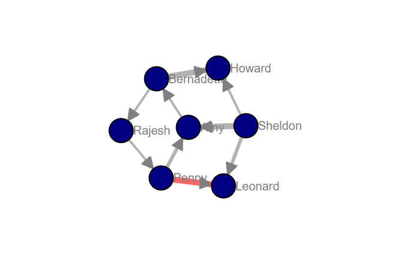
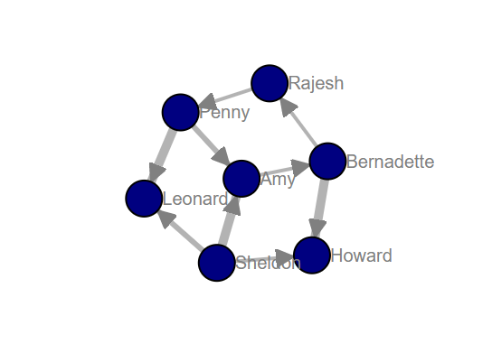
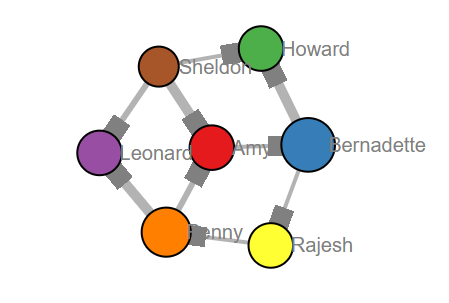
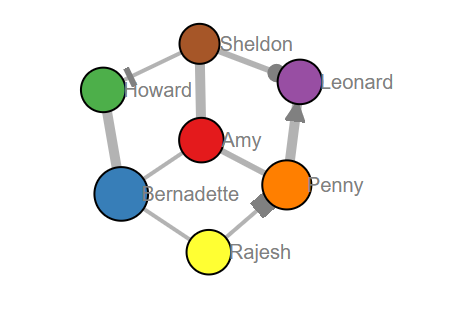

Core Functionalities
'''''''''''''''''''''' 

In order to create, manipulate, and study the structure, dynamics, and functions of complex networks, it is usefull to understand the various functions of ``d3graph``. Here I will describe the core functionalities that can help to customize your network. In the following examples I will be using the **karate** network.

Import
---------------
Importing the ``d3graph`` library is the first step after the pip installation.

.. code:: python
	
	# Import library
	from d3graph import d3graph

Initalization 
--------------
The initialization is directly performed after importing the ``d3graph`` library. During the initialization, the following parameters can be set:

.. code-block::

	* collision	: 0.5		: Response of the network. Higher means that more collisions are prevented.
	* charge	: 250		: Edge length of the network. Towards zero becomes a dense network.
	* slider	: [None, None]	: Slider to break the network. The default is based on the edge weights.
	* verbose	: 20		: Print progress to screen, 60: None, 40: Error, 30: Warn, 20: Info, 10: Debug

**A run with default initialization.**

.. code:: python
	
	# Import library
	from d3graph import d3graph
	# Initialization with default parameters
	d3 = d3graph()
	# Load karate example
	adjmat, df = d3.import_example('karate')
	# Process the adjacency matrix
	d3.graph(adjmat)
	# Plot
	d3.show()

.. raw:: html

   <iframe src="https://erdogant.github.io/docs/d3graph/d3graph/karate_default.html" height="700px" width="850px", frameBorder="0"></iframe>

**The collision parameter**

This network will go wild because it tries to prevent collisions from happening. At some point, the network will stop trying. You can reset it by breaking the network with the silder.

.. code:: python

	# Import library
	from d3graph import d3graph
	# Initialization to make the network be more nervous when nodes are close together.
	d3 = d3graph(collision=3)
	# Load karate example
	adjmat, df = d3.import_example('karate')
	# Process the adjacency matrix
	d3.graph(adjmat)
	# Plot
	d3.show()

.. raw:: html

   <iframe src="https://erdogant.github.io/docs/d3graph/d3graph/karate_collision.html" height="700px" width="850px", frameBorder="0"></iframe>

**The charge parameter.**

This network is much wider than the previous ones. This is certainly helpfull if you have a dense network and need to expand it for visualization purposes.

.. code:: python

	# Import library
	from d3graph import d3graph
	# Initialization to make network edges reltively longer.
	d3 = d3graph(charge=1000)
	# Load karate example
	adjmat, df = d3.import_example('karate')
	# Process the adjacency matrix
	d3.graph(adjmat)
	# Plot
	d3.show()

.. raw:: html

   <iframe src="https://erdogant.github.io/docs/d3graph/d3graph/karate_charge.html" height="700px" width="850px", frameBorder="0"></iframe>

Processing
--------------------------
The graph function :func:`d3graph.d3graph.d3graph.graph` processes the adjacency matrix to create a network with default *node properties* and *edge properties*. The nodes are the column and index names, and a connect edge for vertices with value larger than 0. The strenght of edges are based on the vertices values. The input for ``d3graph`` is the adjacency matrix.

Show
-------------
The show function :func:`d3graph.d3graph.d3graph.show` has several tasks.
	
	* 1. Creating networkx *graph G* based on the node properties and edge properties.
	* 2. Embedding of the data.
	* 3. Writes the final HTML file to disk.
	* 4. Opens the webbroswer with the network graph.

Node properties
'''''''''''''''''

There are various possabilities to customize the network using the node properties function :func:`d3graph.d3graph.d3graph.set_node_properties`. Intially, all default node properties are created which can than be customized. The underneath properties can be changed for each node. I will use the **karate** network to demonstrate the working.

.. note::
	* 1. Node label
	* 1. Node tooltip
	* 2. Node color
	* 3. Node size
	* 4. Node edge color
	* 5. Node text color
	* 6. Node edge size

Node label
-----------------------

Lets change the **node labels** from the *karate* example into something more meaningfull.

.. code:: python

	# Import library
	from d3graph import d3graph
	# Initialization
	d3 = d3graph()
	# Load karate example
	adjmat, df = d3.import_example('karate')
	# Process the adjacency matrix
	d3.graph(adjmat)

	# Set node properties
	d3.set_node_properties(label=df['label'].values)

	# Plot
	d3.show()

.. raw:: html

   <iframe src="https://erdogant.github.io/docs/d3graph/d3graph/karate_label.html" height="700px" width="850px", frameBorder="0"></iframe>

Tooltips
-----------------------

Getting more information when hovering over a node can be easily done using the ``tooltip`` parameter.

.. code:: python

	# Import library
	from d3graph import d3graph
	# Initialization
	d3 = d3graph()
	# Load karate example
	adjmat, df = d3.import_example('karate')
	# Process the adjacency matrix
	d3.graph(adjmat)

	# Set node properties
	tooltip = '\nId: ' + adjmat.columns.astype(str) +'\nDegree: ' + df['degree'].astype(str) + '\nLabel: ' + df['label'].values
	tooltip = tooltip.values
	label = df['label'].values

	# Set node properties
	d3.set_node_properties(label=label, tooltip=tooltip, color=label)
	d3.show()

	# If you want thinner lines
	d3.set_node_properties(label=label, tooltip=tooltip, color=label, minmax=[0.1, 25])
	d3.show()

.. raw:: html

   <iframe src="https://erdogant.github.io/docs/d3graph/d3graph/karate_label_hover.html" height="700px" width="850px", frameBorder="0"></iframe>

Node color
-----------------------

Lets change the **node colors** from the *karate* example using the label information. We do not need to re-initialize the whole graph but we can simply update the node properties.

.. code:: python

	# Set node properties
	d3.set_node_properties(label=df['label'].values, color=df['label'].values)

	# Plot
	d3.show()

.. raw:: html

   <iframe src="https://erdogant.github.io/docs/d3graph/d3graph/karate_label_color.html" height="700px" width="850px", frameBorder="0"></iframe>

Node color on clustering
------------------------

We can also change the node color on the clustering.

.. code:: python

	# Set node properties
	d3.set_node_properties(label=df['label'].values, color='cluster')

	# Plot
	d3.show()

Node fontcolor
---------------

Lets change the **node font colors** and ajust it according to the node color.

.. code:: python

	# Set node properties
	d3.set_node_properties(label=df['label'].values, color='cluster', fontcolor='node_color')

	# Plot
	d3.show()

.. raw:: html

   <iframe src="https://erdogant.github.io/docs/d3graph/d3graph/karate_node_text.html" height="700px" width="850px", frameBorder="0"></iframe>

Node fontsize
---------------

Change the **node fontsize** and ajust it according to the node color.

.. code:: python

	d3 = d3graph()
	adjmat, df = d3.import_example('bigbang')

	fontsize=np.random.randint(low=6, high=40, size=adjmat.shape[0])
	d3.set_node_properties(color='cluster', scaler='minmax', fontcolor='node_color', fontsize=fontsize)

	# Plot
	d3.show()

.. raw:: html

   <iframe src="https://erdogant.github.io/docs/d3graph/d3graph/karate_node_text.html" height="700px" width="850px", frameBorder="0"></iframe>

Node edge color on clustering
-----------------------------

We can also change the node color on the clustering.

.. code:: python

	# Set node properties
	d3.set_node_properties(label=df['label'].values, edge_color='cluster')

	# Plot
	d3.show()

Node size
-----------------------

Lets change the **node size** from the *karate* example using the degree of the network. We do not need to re-initialize the whole graph but we can simply update the node properties.

.. code:: python

	# Set node properties
	d3.set_node_properties(label=df['label'].values, color=df['label'].values, size=df['degree'].values)

	# Plot
	d3.show()

.. raw:: html

   <iframe src="https://erdogant.github.io/docs/d3graph/d3graph/karate_label_color_size.html" height="700px" width="850px", frameBorder="0"></iframe>

Node edge size
-----------------------

Lets change the **node edge size** from the *karate* example using the degree of the network. We do not need to re-initialize the whole graph but we can simply update the node properties.

.. code:: python

	# Set node properties
	d3.set_node_properties(label=df['label'].values, color=df['label'].values, size=df['degree'].values, edge_size=df['degree'].values)

	# Plot
	d3.show()

.. raw:: html

   <iframe src="https://erdogant.github.io/docs/d3graph/d3graph/karate_label_color_size_edge_size.html" height="700px" width="850px", frameBorder="0"></iframe>

Node edge color
-----------------------

Lets change the **node edge color** from the *karate* example using a specified color. We do not need to re-initialize the whole graph but we can simply update the node properties.

.. code:: python

	# Set node properties
	d3.set_node_properties(label=df['label'].values, color=df['label'].values, size=df['degree'].values, edge_size=df['degree'].values, edge_color='#FFF000')

	# Plot
	d3.show()

.. raw:: html

   <iframe src="https://erdogant.github.io/docs/d3graph/d3graph/karate_label_color_size_edge_size_edge_color.html" height="700px" width="850px", frameBorder="0"></iframe>

Customize the properties of one specific node
-----------------------------------------------

.. code:: python

	# Import library
	from d3graph import d3graph
	# Initialization
	d3 = d3graph()
	# Load karate example
	adjmat, _ = d3.import_example('bigbang')
	# Process the adjacency matrix
	d3.graph(adjmat)

	# Examine the node properties
	print(d3.node_properties)
	# {'Amy': {'label': 'Amy', 'color': '#000080', 'size': 10, 'edge_size': 0.1, 'edge_color': '#000000'},
	# 'Bernadette': {'label': 'Bernadette', 'color': '#000080', 'size': 10, 'edge_size': 0.1, 'edge_color': '#000000'}, 
	# 'Howard': {'label': 'Howard', 'color': '#000080', 'size': 10, 'edge_size': 0.1, 'edge_color': '#000000'},
	# 'Leonard': {'label': 'Leonard', 'color': '#000080', 'size': 10, 'edge_size': 0.1, 'edge_color': '#000000'},
	# 'Penny': {'label': 'Penny', 'color': '#000080', 'size': 10, 'edge_size': 0.1, 'edge_color': '#000000'},
	# 'Rajesh': {'label': 'Rajesh', 'color': '#000080', 'size': 10, 'edge_size': 0.1, 'edge_color': '#000000'},
	# 'Sheldon': {'label': 'Sheldon', 'color': '#000080', 'size': 10, 'edge_size': 0.1, 'edge_color': '#000000'}}

	# Customize the properties of one specific node
	d3.node_properties['Penny']['label']='Penny Hofstadter'
	d3.node_properties['Penny']['color']='#ffc0cb' # Pink
	d3.node_properties['Penny']['size']=20
	d3.node_properties['Penny']['edge_size']=5
	d3.node_properties['Penny']['edge_color']='#0000ff' # Blue

	# Customize a specific edge property
	d3.edge_properties['Penny', 'Leonard']['color']='#FF0000' # red
	
	# Print
	print(d3.node_properties['Penny'])
	# {'label': 'Penny Hofstadter', 'color': '#ffc0cb', 'size': 20, 'edge_size': 5, 'edge_color': '#000000'}

	# Plot
	d3.show()

.. raw:: html

   <iframe src="https://erdogant.github.io/docs/d3graph/d3graph/bigbang_Penny.html" height="700px" width="850px", frameBorder="0"></iframe>

Edge properties
'''''''''''''''''

The **edge properties** can be customized using four options. After creating the ``d3.graph()``, the edges are based on the strength of the vertices.

Edge network properties can also be changed for the edges:

.. note::
	* 1. weight
	* 2. edge_distance
	* 3. edge_distance_minmax
	* 4. color
	* 5. directed
	* 6. marker

Customize Edge Properties
--------------------------

.. code:: python

	# Import library
	from d3graph import d3graph
	# Initialization
	d3 = d3graph()
	# Load karate example
	adjmat, _ = d3.import_example('bigbang')
	# Process the adjacency matrix
	d3.graph(adjmat)

	# Examine the node properties
	print(d3.edge_properties)
	# ('Sheldon', 'Amy'): {'weight': 5.0, 'weight_scaled': 20.0, 'color': '#000000'},
	# ('Sheldon', 'Howard'): {'weight': 2.0, 'weight_scaled': 1.0, 'color': '#000000'},
	# ('Sheldon', 'Leonard'): {'weight': 3.0,'weight_scaled': 7.3333, 'color': '#000000'}}
	# ...
  
	# Set to directed edges
	d3.set_edge_properties(directed=True)

	# Customize the properties of one specific edge
	d3.edge_properties[('Sheldon', 'Howard')]['weight']=10
	d3.edge_properties[('Penny', 'Leonard')]['color']='#ff0000'
	
	# Plot
	d3.show()

.. table:: Edge properties
   :align: center

   +---------+
   | |fig1a| |
   +---------+

Normalization
---------------------

There are two manners to scale the edges; scaling using the **minmax** or scaling using the **z-score**.
The default option is the z-score because the results tends to better in most use-cases.
Let's see the differences between the different methods.

.. code:: python

	# Import library
	from d3graph import d3graph
	# Initialization
	d3 = d3graph()
	# Load karate example
	adjmat, _ = d3.import_example('bigbang')
	# Process the adjacency matrix
	d3.graph(adjmat)

  	# Set to no scaler (default)
	d3.set_edge_properties(directed=True, minmax=[1, 20], scaler=None)
	d3.show()

	# Set to minmax scaler
	d3.set_edge_properties(directed=True, minmax=[1, 20], scaler='minmax')
	d3.show()

	# Set to zscore scaler (default)
	d3.set_edge_properties(directed=True, minmax=[1, 20], scaler='zscore')
	d3.show()

.. |fig2b| image:: ../figs/example_fig2b.png
.. |fig2c| image:: ../figs/example_fig2c.png
    :scale: 70%

.. table:: Normalizations on the edge width. Left=No normalization, middle=minmax, right=z-score.
   :align: center

   +---------+---------+---------+
   | |fig2a| | |fig2b| | |fig2c| |
   +---------+---------+---------+

Markers
---------------------

The **start** and **end** of the edges can be set for the following markers:
	* arrow
	* circle
	* square
	* stub
	* None or ''

The default ``marker_end`` is set to **arrow** whereas the ``marker_start`` is set to **None**.
Each marker can be customized using the ``edge_properties``.

.. code:: python

	# Import library
	from d3graph import d3graph
	# Initialization
	d3 = d3graph()
	# Load karate example
	adjmat, _ = d3.import_example('bigbang')
	# Process the adjacency matrix
	d3.graph(adjmat)
	# Set some node properties
	d3.set_node_properties(color=adjmat.columns.values, size=[10, 20, 10, 10, 15, 10, 5])

  	# Edge properties
	print(d3.edge_properties)
	# {('Amy', 'Bernadette'): {'weight': 2.0, 'weight_scaled': 2.0, 'color': '#808080', 'marker_start': '', 'marker_end': 'arrow', ...
	
	# Set all marker-end to square and keep marker_start to be None or ''
	d3.set_edge_properties(directed=True, marker_end='square', marker_start='')
	d3.show()

	# Make some customized changes in the marker-end by removing all markers and set one for penny-leonard.
	d3.set_edge_properties(directed=True, marker_end='')

	# Set markers for individual edges
	d3.edge_properties['Penny', 'Leonard']['marker_end']='arrow'
	d3.edge_properties['Sheldon', 'Howard']['marker_end']='stub'
	d3.edge_properties['Sheldon', 'Leonard']['marker_end']='circle'
	d3.edge_properties['Rajesh', 'Penny']['marker_end']='square'
	d3.show()

.. table:: Edge markers. Left=marker-end to square, right=arrow only for one edge.
   :align: center

   +---------+---------+
   | |fig3a| | |fig3b| |
   +---------+---------+

Various 
----------------

.. code:: python
	
	# Set edge properties with a edge distance
	d3.set_edge_properties(edge_distance=100)

	# Plot
	d3.show()

.. include:: add_bottom.add